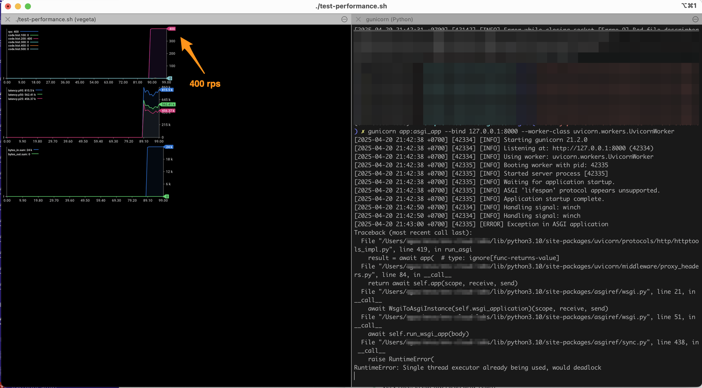
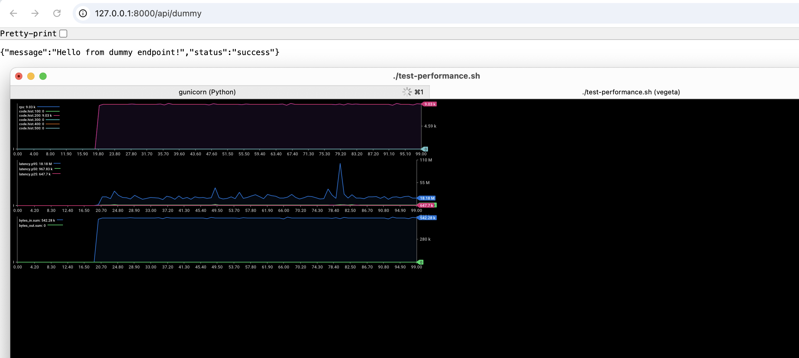
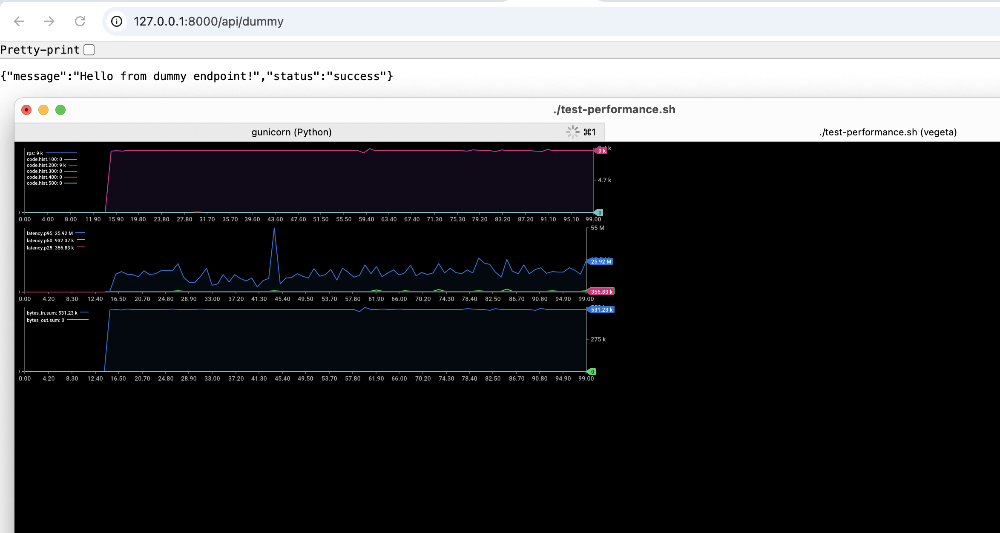

# Flask Performance Test Comparison

This repository contains a performance comparison between a traditional Flask application, an async Quart application, and a FastAPI application, all using Gunicorn with Uvicorn workers.

## Project Structure

```
.
├── flask-app/        # Traditional Flask implementation
│   ├── app.py       # Flask application
│   ├── gunicorn_config.py
│   ├── requirements.txt
│   ├── __init__.py
│   └── README.md
│
├── quart-app/        # Async Quart implementation
│   ├── app.py       # Quart application
│   ├── gunicorn_config.py
│   ├── requirements.txt
│   ├── __init__.py
│   └── README.md
│
├── fastapi-app/      # FastAPI implementation
│   ├── app.py       # FastAPI application
│   ├── gunicorn_config.py
│   ├── requirements.txt
│   └── README.md
│
├── test-performance.sh  # Performance testing script
├── .gitignore          # Git ignore file
└── .img/               # Performance comparison images
    ├── flask.png       # Flask performance results
    ├── quart.png       # Quart performance results
    └── fast-api.png    # FastAPI performance results
```

## Overview

This project demonstrates the performance differences between:
1. A traditional Flask application with ASGI middleware
2. A native async Quart application
3. A modern FastAPI application

All implementations use:
- Gunicorn as the WSGI/ASGI server
- Uvicorn workers for improved performance
- Similar API endpoints for fair comparison
- Performance testing tools (Vegeta) for benchmarking

## Implementation Details

### Flask Implementation (flask-app)
- Uses Flask 3.0.2 with ASGI middleware (asgiref.wsgi.WsgiToAsgi)
- Synchronous request handling
- Fixed worker count (4 workers)
- Test rate: 400 requests per second

### Quart Implementation (quart-app)
- Uses Quart 0.19.4 (async-first Flask alternative)
- Native async request handling with `async def` endpoints
- Dynamic worker count based on CPU cores: `cpu_count * 2 + 1`
- Advanced Gunicorn configuration with:
  - Worker connections: 1000
  - Max requests: 1000
  - Max requests jitter: 50
- Test rate: 5000 requests per second (12.5x higher than Flask)

### FastAPI Implementation (fastapi-app)
- Uses FastAPI 0.110.0 (modern, fast web framework)
- Native async request handling with `async def` endpoints
- Built on Starlette and Pydantic
- Dynamic worker count based on CPU cores: `cpu_count * 2 + 1`
- Advanced Gunicorn configuration with:
  - Worker connections: 1000
  - Max requests: 1000
  - Max requests jitter: 50
- Test rate: 5000 requests per second

## Key Differences

### Flask (flask-app)
- Traditional synchronous Flask application
- Uses ASGI middleware for Uvicorn compatibility
- Standard Flask routing and request handling
- Limited concurrency due to synchronous nature

### Quart (quart-app)
- Native async framework
- Built-in ASGI support
- Async-first approach to request handling
- Better suited for high-concurrency scenarios
- More optimized Gunicorn configuration

### FastAPI (fastapi-app)
- Modern, high-performance framework
- Built on Starlette and Pydantic
- Automatic API documentation (Swagger UI)
- Type validation and serialization
- Native async support
- Designed for high performance from the ground up

## Getting Started

1. Choose which implementation to test:
   - For Flask: `cd flask-app`
   - For Quart: `cd quart-app`
   - For FastAPI: `cd fastapi-app`

2. Follow the installation and running instructions in the respective README.md files.

## Performance Testing

A shared `test-performance.sh` script is available in the root directory for testing all implementations:
- Sends requests at configurable rates (default: 9000/s)
- Measures response times and throughput
- Provides real-time metrics visualization

To run the tests:
```bash
# Make the script executable
chmod +x test-performance.sh

# Run the test (make sure the application is running first)
./test-performance.sh
```

You can modify the rate in the script by changing the `-rate=9000/s` parameter.

## Performance Results

The `.img` directory contains visualizations of the performance test results. Below is a side-by-side comparison:

| Flask Performance | Quart Performance | FastAPI Performance |
|------------------|-------------------|---------------------|
|  |  |  |

These visualizations show:
- Requests per second (RPS)
- Response latency percentiles
- Error rates
- Throughput over time

You can compare these visualizations to see the performance benefits of using async frameworks like Quart and FastAPI.

## Requirements

- Python 3.8 or higher
- pip (Python package installer)
- For performance testing:
  - Vegeta (HTTP load testing tool)
  - jaggr and jplot (for metrics visualization)

## Installation of Testing Tools

```bash
# Install Vegeta
brew update && brew install vegeta

# Install plotting tools
brew install rs/tap/jaggr
brew install rs/tap/jplot
```

## See Also

- [Flask Documentation](https://flask.palletsprojects.com/)
- [Quart Documentation](https://quart.palletsprojects.com/)
- [FastAPI Documentation](https://fastapi.tiangolo.com/)
- [Gunicorn Documentation](https://docs.gunicorn.org/)
- [Uvicorn Documentation](https://www.uvicorn.org/)
- [Vegeta Documentation](https://github.com/tsenart/vegeta) 
