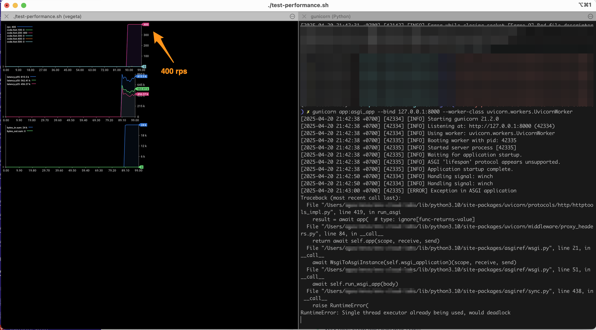
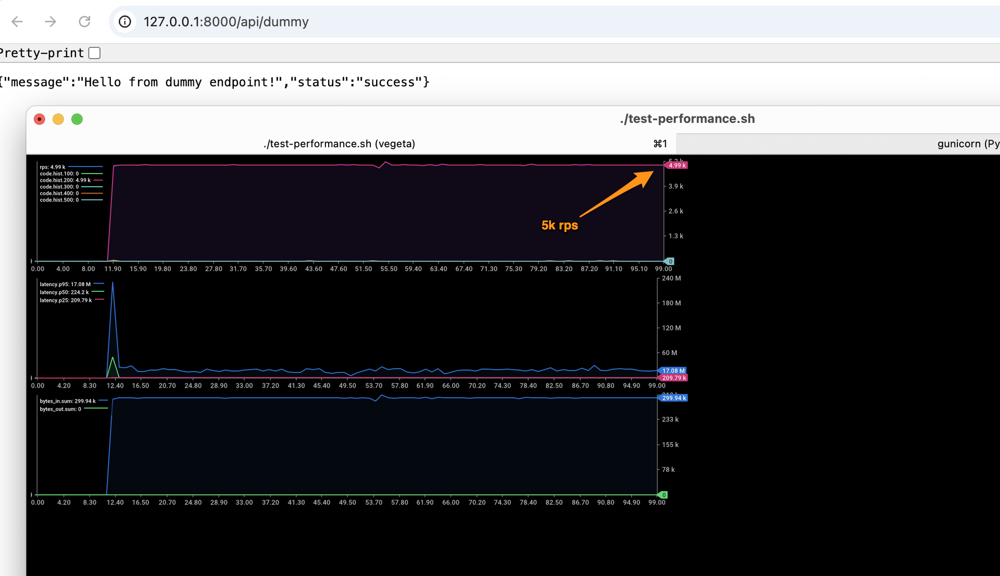

# Flask Performance Test Comparison

This repository contains a performance comparison between a traditional Flask application and an async Quart application, both using Gunicorn with Uvicorn workers.

## Project Structure

```
.
├── before/           # Traditional Flask implementation
│   ├── app.py       # Flask application
│   ├── gunicorn_config.py
│   ├── requirements.txt
│   ├── test-performance.sh
│   └── README.md
│
└── after/           # Async Quart implementation
    ├── app.py       # Quart application
    ├── gunicorn_config.py
    ├── requirements.txt
    ├── test-performance.sh
    └── README.md
```

## Overview

This project demonstrates the performance differences between:
1. A traditional Flask application with ASGI middleware
2. A native async Quart application

Both implementations use:
- Gunicorn as the WSGI/ASGI server
- Uvicorn workers for improved performance
- Similar API endpoints for fair comparison
- Performance testing tools (Vegeta) for benchmarking

## Implementation Details

### Flask Implementation (Before)
- Uses Flask 3.0.2 with ASGI middleware (asgiref.wsgi.WsgiToAsgi)
- Synchronous request handling
- Fixed worker count (4 workers)
- Test rate: 400 requests per second

### Quart Implementation (After)
- Uses Quart 0.19.4 (async-first Flask alternative)
- Native async request handling with `async def` endpoints
- Dynamic worker count based on CPU cores: `cpu_count * 2 + 1`
- Advanced Gunicorn configuration with:
  - Worker connections: 1000
  - Max requests: 1000
  - Max requests jitter: 50
- Test rate: 5000 requests per second (12.5x higher than Flask)

## Key Differences

### Before (Flask)
- Traditional synchronous Flask application
- Uses ASGI middleware for Uvicorn compatibility
- Standard Flask routing and request handling
- Limited concurrency due to synchronous nature

### After (Quart)
- Native async framework
- Built-in ASGI support
- Async-first approach to request handling
- Better suited for high-concurrency scenarios
- More optimized Gunicorn configuration

## Getting Started

1. Choose which implementation to test:
   - For Flask: `cd before`
   - For Quart: `cd after`

2. Follow the installation and running instructions in the respective README.md files.

## Performance Testing

Both implementations include a `test-performance.sh` script that:
- Sends requests at different rates (400/s for Flask, 5000/s for Quart)
- Measures response times and throughput
- Provides real-time metrics visualization

To run the tests:
```bash
# Make the script executable
chmod +x test-performance.sh

# Run the test
./test-performance.sh
```

## Performance Results

The `.img` directory contains visualizations of the performance test results. Below is a side-by-side comparison:

| Flask Performance (Before) | Quart Performance (After) |
|---------------------------|---------------------------|
|  |  |

These visualizations show:
- Requests per second (RPS)
- Response latency percentiles
- Error rates
- Throughput over time

You can compare these visualizations to see the performance benefits of using an async framework like Quart.

## Requirements

- Python 3.8 or higher
- pip (Python package installer)
- For performance testing:
  - Vegeta (HTTP load testing tool)
  - jaggr and jplot (for metrics visualization)

## Installation of Testing Tools

```bash
# Install Vegeta
brew update && brew install vegeta

# Install plotting tools
brew install rs/tap/jaggr
brew install rs/tap/jplot
```

## See Also

- [Flask Documentation](https://flask.palletsprojects.com/)
- [Quart Documentation](https://quart.palletsprojects.com/)
- [Gunicorn Documentation](https://docs.gunicorn.org/)
- [Uvicorn Documentation](https://www.uvicorn.org/)
- [Vegeta Documentation](https://github.com/tsenart/vegeta) 
