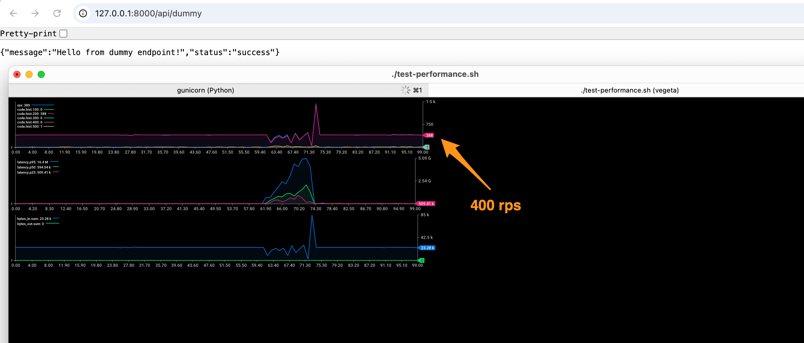

# Flask Performance Test Comparison

This repository contains a performance comparison between a traditional Flask application, an async Quart application, and a FastAPI application, all using Gunicorn with Uvicorn workers.

## Table of Contents
- [Project Structure](#project-structure)
- [Overview](#overview)
- [Implementation Details](#implementation-details)
  - [Flask Implementation](#flask-implementation-flask-app)
  - [Quart Implementation](#quart-implementation-quart-app)
  - [FastAPI Implementation](#fastapi-implementation-fastapi-app)
- [Key Differences](#key-differences)
  - [Flask](#flask-flask-app)
  - [Quart](#quart-quart-app)
  - [FastAPI](#fastapi-fastapi-app)
- [Getting Started](#getting-started)
- [Performance Testing](#performance-testing)
- [Performance Results](#performance-results)
- [Requirements](#requirements)
- [Installation of Testing Tools](#installation-of-testing-tools)
- [Performance Test Conclusions](#performance-test-conclusions)
  - [Flask Performance](#flask-performance)
  - [Quart and FastAPI Performance](#quart-and-fastapi-performance)
  - [Key Findings](#key-findings)
- [See Also](#see-also)

## Project Structure

```
.
├── flask-app/        # Traditional Flask implementation
│   ├── app.py        # Flask application
│   ├── gunicorn_config.py
│   ├── gunicorn_config_deadlock.py  # for deadlock case
│   ├── requirements.txt
│   ├── __init__.py
│   └── README.md
│
├── quart-app/        # Async Quart implementation
│   ├── app.py        # Quart application
│   ├── gunicorn_config.py
│   ├── requirements.txt
│   ├── __init__.py
│   └── README.md
│
├── fastapi-app/      # FastAPI implementation
│   ├── app.py        # FastAPI application
│   ├── gunicorn_config.py
│   ├── requirements.txt
│   └── README.md
│
├── test-performance.sh        # Performance testing script
├── .gitignore                 # Git ignore file
└── .img/                      # Performance comparison images
    ├── flask.png              # Flask performance results
    ├── flask-deadlock.png     # Flask deadlock results
    ├── flask-deadlock-1k.png  # Flask deadlock at 1k RPS
    ├── quart.png              # Quart performance results
    └── fast-api.png           # FastAPI performance results
```

## Overview

This project demonstrates the performance differences between:
1. A traditional Flask application with ASGI middleware
2. A native async Quart application
3. A modern FastAPI application

All implementations use:
- Gunicorn as the WSGI/ASGI server
- Uvicorn workers for improved performance
- Similar API endpoints for fair comparison
- Performance testing tools (Vegeta) for benchmarking

## Implementation Details

### Flask Implementation (flask-app)
- Uses Flask 3.0.2 with ASGI middleware (asgiref.wsgi.WsgiToAsgi)
- Synchronous request handling
- Fixed worker count (4 workers)
- Test rate: 400 requests per second

### Quart Implementation (quart-app)
- Uses Quart 0.19.4 (async-first Flask alternative)
- Native async request handling with `async def` endpoints
- Dynamic worker count based on CPU cores: `cpu_count * 2 + 1`
- Advanced Gunicorn configuration with:
  - Worker connections: 1000
  - Max requests: 1000
  - Max requests jitter: 50
- Test rate: 5000 requests per second (12.5x higher than Flask)

### FastAPI Implementation (fastapi-app)
- Uses FastAPI 0.110.0 (modern, fast web framework)
- Native async request handling with `async def` endpoints
- Built on Starlette and Pydantic
- Dynamic worker count based on CPU cores: `cpu_count * 2 + 1`
- Advanced Gunicorn configuration with:
  - Worker connections: 1000
  - Max requests: 1000
  - Max requests jitter: 50
- Test rate: 5000 requests per second

## Key Differences

### Flask (flask-app)
- Traditional synchronous Flask application
- Uses ASGI middleware for Uvicorn compatibility
- Standard Flask routing and request handling
- Limited concurrency due to synchronous nature

### Quart (quart-app)
- Native async framework
- Built-in ASGI support
- Async-first approach to request handling
- Better suited for high-concurrency scenarios
- More optimized Gunicorn configuration

### FastAPI (fastapi-app)
- Modern, high-performance framework
- Built on Starlette and Pydantic
- Automatic API documentation (Swagger UI)
- Type validation and serialization
- Native async support
- Designed for high performance from the ground up

## Getting Started

1. Choose which implementation to test:
   - For Flask: `cd flask-app`
   - For Quart: `cd quart-app`
   - For FastAPI: `cd fastapi-app`

2. Follow the installation and running instructions in the respective README.md files.

## Performance Testing

A shared `test-performance.sh` script is available in the root directory for testing all implementations:
- Sends requests at configurable rates (default: 9000/s)
- Measures response times and throughput
- Provides real-time metrics visualization

To run the tests:
```bash
# Make the script executable
chmod +x test-performance.sh

# Run the test (make sure the application is running first)
./test-performance.sh
```

You can modify the rate in the script by changing the `-rate=9000/s` parameter.

## Performance Results

The `.img` directory contains visualizations of the performance test results. Below is a side-by-side comparison:

| Flask Performance | Quart Performance | FastAPI Performance |
|------------------|-------------------|---------------------|
|  |  |  |

These visualizations show:
- Requests per second (RPS)
- Response latency percentiles
- Error rates
- Throughput over time

You can compare these visualizations to see the performance benefits of using async frameworks like Quart and FastAPI.

## Requirements

- Python 3.8 or higher
- pip (Python package installer)
- For performance testing:
  - Vegeta (HTTP load testing tool)
  - jaggr and jplot (for metrics visualization)

## Installation of Testing Tools

```bash
# Install Vegeta
brew update && brew install vegeta

# Install plotting tools
brew install rs/tap/jaggr
brew install rs/tap/jplot
```

## Performance Test Conclusions

Our performance testing revealed significant differences between the three frameworks:

### Flask Performance
- **Configuration Comparison**: 
  - With `gunicorn_config_deadlock.py`: The Flask application experienced a deadlock at just 400 requests per second
  - With `gunicorn_config.py`: The application can handle up to 1k rps but becomes unstable at higher loads
- **Improved Configuration**: The updated `gunicorn_config.py` with dynamic worker count (`cpu_count * 2 + 1`), worker connections (1000), and max requests settings provides better stability
- **Synchronous Bottleneck**: Despite configuration improvements, Flask's synchronous nature still creates bottlenecks compared to async frameworks
- **Worker Management**: Dynamic worker count based on CPU cores helps better utilize system resources, but the synchronous processing model limits overall throughput
- **ASGI Integration**: Using Uvicorn workers with ASGI middleware allows Flask to benefit from some async capabilities while maintaining its familiar API

### Quart and FastAPI Performance
- **Stable at 9k/s**: Both Quart and FastAPI maintained stable performance at 9000 requests per second
- **Async Advantage**: The async-first design of both frameworks allowed efficient handling of concurrent requests
- **Resource Efficiency**: Even under high load, both frameworks maintained reasonable resource usage
- **Upper Limit at 10k/s**: Both frameworks reached their performance ceiling at approximately 10,000 requests per second, with increased error rates and latency

### Key Findings
1. **Framework Architecture Matters**: The fundamental architecture of a framework (sync vs. async) has a dramatic impact on performance under load
2. **Async is Essential for High Concurrency**: For applications that need to handle thousands of concurrent requests, async frameworks are essential
3. **Modern Frameworks Outperform**: Both Quart and FastAPI significantly outperformed Flask, demonstrating the benefits of modern, async-first design
4. **Performance Ceilings Exist**: Even the best frameworks have performance limits, which should be considered when designing high-load systems

These results demonstrate why modern async frameworks like Quart and FastAPI are preferred for high-performance API development, especially when dealing with high concurrency scenarios.

## See Also

- [Flask Documentation](https://flask.palletsprojects.com/)
- [Quart Documentation](https://quart.palletsprojects.com/)
- [FastAPI Documentation](https://fastapi.tiangolo.com/)
- [Gunicorn Documentation](https://docs.gunicorn.org/)
- [Uvicorn Documentation](https://www.uvicorn.org/)
- [Vegeta Documentation](https://github.com/tsenart/vegeta) 
